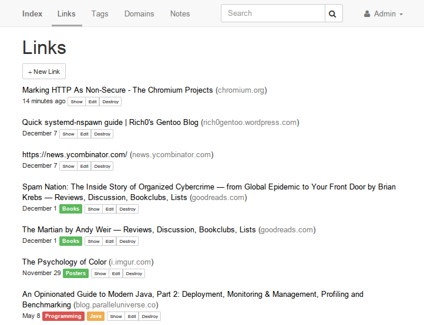

Index
=====

   

Index is a bookmarking application that can be self-hosted. It has clients for [Firefox](https://github.com/nygrenh/index-firefox), [Chrome](https://github.com/nygrenh/index-chrome) and [Android](https://github.com/nygrenh/index-android).

Demo server: https://theindex.herokuapp.com/.

